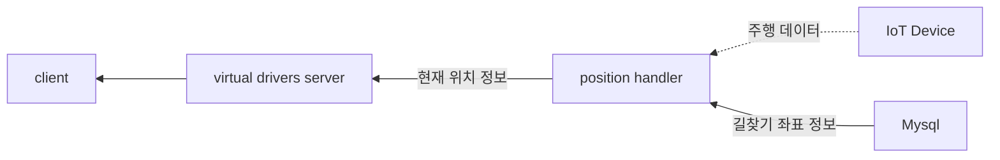
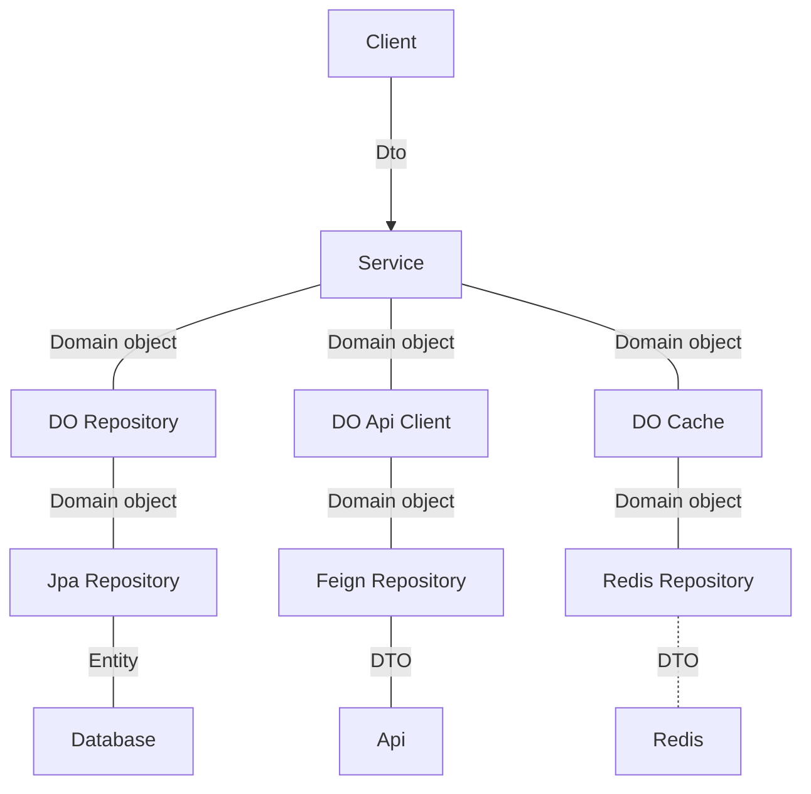

# Virtual drivers

가상 차량 관제 서비스입니다.

### Workflow

실 주행 데이터가 없으므로 길찾기 api 에서 반환되는 위치 정보를 실시간 위치로 사용합니다.



### Architecture



## terraform

### aws-vault 설정

- 준비
  - iam 유저 생성
  - mfa 등록
  - access key 발급
- 로컬 세팅
  - https://dev.classmethod.jp/articles/managing-iam-roles-with-aws-vault/

### 명령어

```
avs exec disdong -- terraform -chdir=infra/terraform/app/prod plan
```

## 참고

- 주소검색
  - postcodify: https://www.poesis.org/postcodify/guide/jquery_plugin
- 길찾기
  - directions 5: https://guide.ncloud-docs.com/docs/maps-direction5-api
- 주소/좌표 변환
  - geocode: https://api.ncloud-docs.com/docs/ai-naver-mapsgeocoding-geocode
