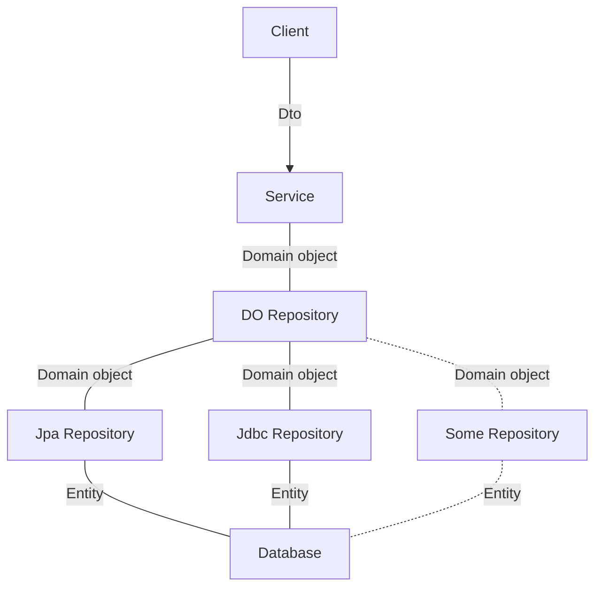

# Springboot template

SpringBoot 기반 서버 구현을 위한 템플릿입니다.

### Flow

### 참고
- postcodify: https://www.poesis.org/postcodify/guide/jquery_plugin
- directions 5: https://guide.ncloud-docs.com/docs/maps-direction5-api
- geolocation: https://www.ncloud.com/product/applicationService/geoLocation